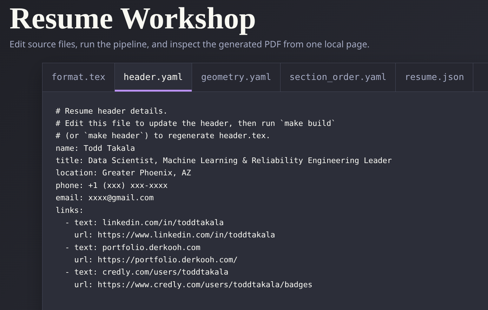
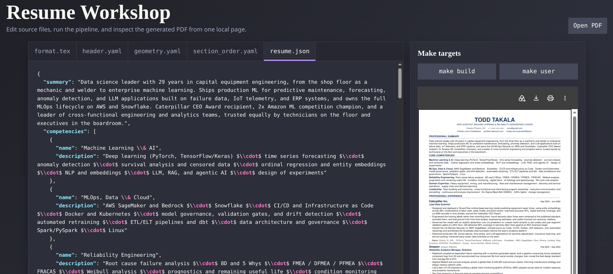

# Resume Workshop

Resume Workshop is a source-driven LaTeX resume builder. Resume content and
metadata live in editable YAML, JSON, and TeX files; small Python generators
convert the structured inputs into interim LaTeX, and Make targets build the
final PDF and plain-text resume. The project also includes an optional local
browser editor and a Docker-based build path for a reproducible toolchain.

## Contents

- [Resume Workshop](#resume-workshop)
  - [Contents](#contents)
  - [Requirements](#requirements)
  - [Quick start](#quick-start)
  - [Project layout](#project-layout)
  - [Make targets](#make-targets)
  - [Editing the resume](#editing-the-resume)
  - [Local editor](#local-editor)
  - [Screenshots](#screenshots)
  - [Generated files](#generated-files)
  - [Docker workflow](#docker-workflow)
  - [Spell checking](#spell-checking)

## Requirements

For a native build, install Python 3.13 or newer, GNU Make, a TeX Live
installation with the packages used by [input/format.tex](input/format.tex),
and Pandoc. Python dependencies are intentionally limited to the standard
library; [requirements.txt](requirements.txt) is provided for documentation.

If the LaTeX or Pandoc toolchain is not installed locally, use the Docker
workflow instead.

## Quick start

1. Edit the source files in [input/](input/).
2. Run `make build`.
3. Open `output/resume.pdf` or `output/resume.txt`.

To create a filename based on the name in the header, run `make user`. The
current generated copy is `output/todd_takala_resume.pdf`.

## Project layout

- [input/](input/) contains the editable resume data, page geometry, and LaTeX layout.
- [scripts/](scripts/) contains the standard-library Python generators and browser editor.
- [interim/](interim/) contains generated LaTeX fragments used during a build.
- [output/](output/) contains generated PDF and plain-text resume files.
- [docker/](docker/) contains the reproducible build image definition.
- [etc/](etc/) contains cspell configuration and project-specific words.

## Make targets

- `make build` regenerates all interim files, then creates `output/resume.pdf` and `output/resume.txt`.
- `make header` regenerates `interim/header.tex` from [input/header.yaml](input/header.yaml) without a full build.
- `make geometry` regenerates `interim/geometry.tex` from [input/geometry.yaml](input/geometry.yaml) without a full build.
- `make resume` regenerates `interim/resume_content.tex` from [input/resume.json](input/resume.json) and [input/section_order.yaml](input/section_order.yaml) without a full build.
- `make user` creates `output/<name>_resume.pdf`, where `<name>` is the `name`
  field from [input/header.yaml](input/header.yaml), lowercased, with spaces
  replaced by underscores and everything else reduced to alphanumerics/underscores
  — currently `output/todd_takala_resume.pdf`.
- `make editor` starts a local browser editor for the files in `input/`, the `build`/`user` Makefile targets, and the generated PDF.
- `make clean` removes auxiliary pdflatex files and generated interim files.
- `make docker-image` builds the local `resume-builder` Docker image.
- `make docker-build` builds a Docker image with pdflatex/pandoc/python3 and
  runs `make build` inside a container against this directory — use this if
  you don't have the LaTeX/pandoc toolchain installed locally. Output files
  land in the `output/` directory, owned by your user, same as a native build.
- `make docker-editor` runs the local browser editor inside that same Docker
  image (via `--network host`) — use this if you don't have Python installed
  locally either.

## Editing the resume

Name, title, location, phone, email, and links live in [input/header.yaml](input/header.yaml)
instead of the `.tex` file. Edit that file and run `make build` (or `make header`)
to regenerate `interim/header.tex`, which [input/format.tex](input/format.tex) pulls in via `\input`.
`interim/header.tex` is generated (git-ignored) — don't edit it directly.

Page geometry lives in [input/geometry.yaml](input/geometry.yaml). Edit that
file and run `make build` (or `make geometry`) to regenerate
`interim/geometry.tex`.

The complete resume content is stored in [input/resume.json](input/resume.json) and
rendered into `interim/resume_content.tex`. Edit [input/section_order.yaml](input/section_order.yaml)
to control the order of the top-level resume sections. The [input/format.tex](input/format.tex)
file contains the LaTeX layout, commands, and document configuration.

## Local editor

Run `make editor` or `python3 scripts/editor.py`, then open the displayed local URL.
The editor uses only Python's standard library and does not require Tkinter or third-party
packages.

The editor highlights LaTeX commands (`\command`) in every file, plus JSON object
keys when editing `input/resume.json`. A "Pretty-print JSON" button reformats
`resume.json` with indentation, a word-wrap toggle switches the editor between
wrapped and horizontally-scrolling lines, and saving `resume.json` validates it
as JSON first — an invalid save is rejected with an error instead of being written.

[etc/dictionary.txt](etc/dictionary.txt) contains project-specific spell-check terms,
configured via [etc/cspell.json](etc/cspell.json).
The local editor enables the browser's native spellcheck while editing.
[scripts/generate_header.py](scripts/generate_header.py) parses the YAML with no third-party dependencies (matching
this repo's goal of using only a standard TeX Live install), so it only supports
a narrow subset: flat `key: value` pairs plus one `links:` list of `text`/`url`
pairs, as shown in the existing file.

## Screenshots

These focused captures show the Dracula-themed source editor without including
the generated PDF or plain-text resume output.

The structured resume content can be edited directly as JSON, with syntax
highlighting and formatting controls available in the editor.

* Example [resume.pdf](output/resume.pdf) file
* Example [resume.txt](output/resume.txt) file

## Generated files

Files under `interim/` are generated and should not be edited directly. Update
the corresponding file under [input/](input/) and run the matching generator or
`make build`. Auxiliary LaTeX files and generated interim files can be removed
with `make clean`.

## Docker workflow

The Docker image installs Python 3, GNU Make, Pandoc, and the TeX Live packages
needed by the resume. Run `make docker-build` from the repository root to build
without installing those tools locally. Run `make docker-editor` to launch the
browser editor in the container; its default address is
`http://127.0.0.1:8765/`. Set `RESUME_EDITOR_PORT` to use another port.

## Spell checking

[etc/dictionary.txt](etc/dictionary.txt) contains project-specific spell-check
terms, configured via [etc/cspell.json](etc/cspell.json). The local editor also
enables the browser's native spellcheck while editing.
