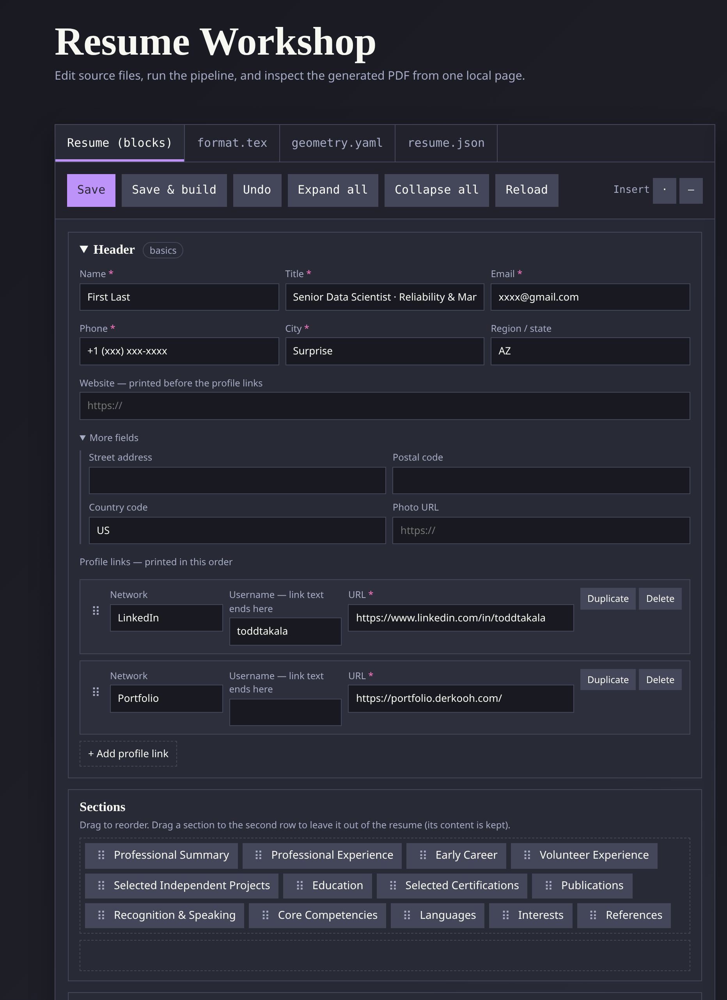
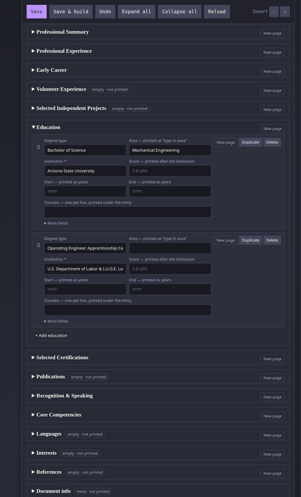
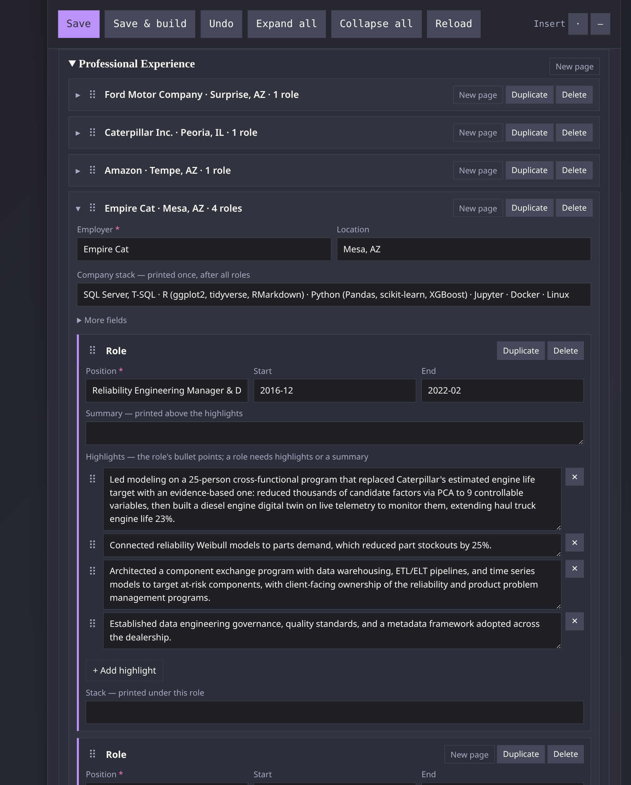
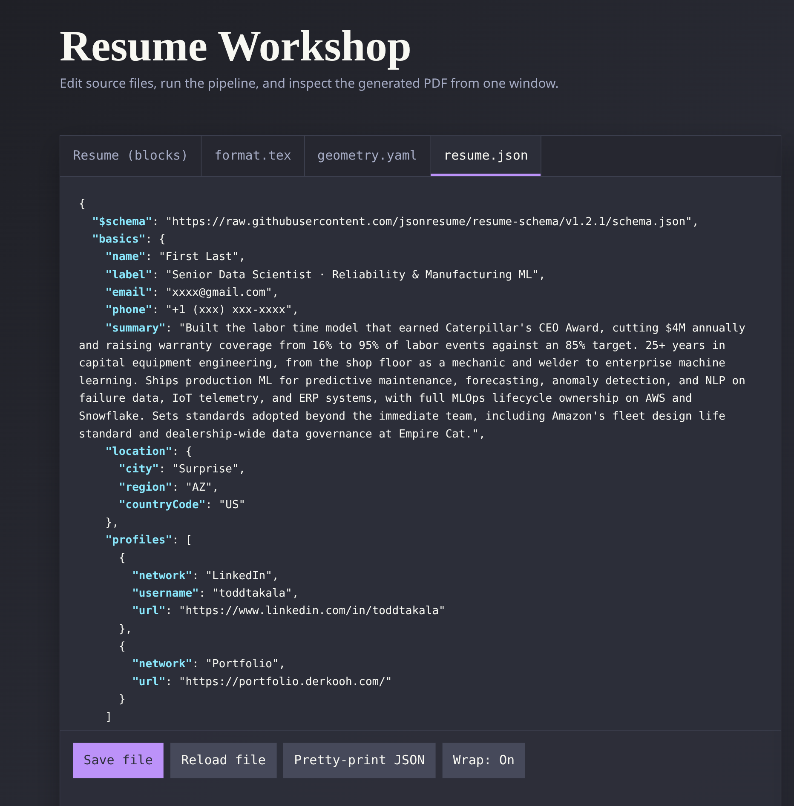
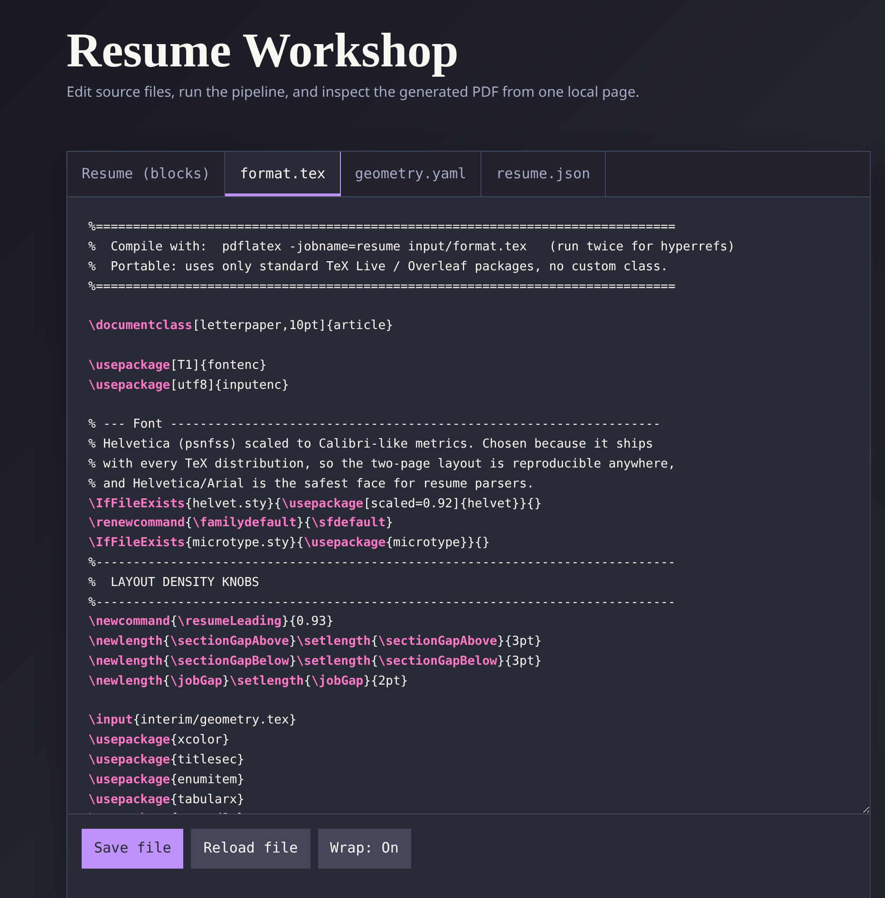

# Resume Workshop

Resume Workshop is a source-driven LaTeX resume builder. The resume's content
lives in a single [JSON Resume](https://jsonresume.org/schema) document, with
page geometry and section order in small YAML files and the layout in a TeX
file. Standard-library Python generators turn those inputs into interim LaTeX,
and Make targets build the final PDF and plain-text resume, plus a
[Reactive Resume](https://rxresu.me) export for importing there. The project also
includes an optional desktop editor with a drag-and-drop block view of
the resume, and a Docker-based build path for a reproducible toolchain.



## Contents

- [Resume Workshop](#resume-workshop)
  - [Contents](#contents)
  - [Requirements](#requirements)
  - [Quick start](#quick-start)
  - [Project layout](#project-layout)
  - [Make targets](#make-targets)
  - [Editing the resume](#editing-the-resume)
  - [Local editor](#local-editor)
  - [Reactive Resume export](#reactive-resume-export)
  - [Generated files](#generated-files)
  - [Docker workflow](#docker-workflow)
  - [Spell checking](#spell-checking)
  - [Credits](#credits)

## Requirements

For a native build, install Python 3.13 or newer, GNU Make, a TeX Live
installation with the packages used by [input/format.tex](input/format.tex),
and Pandoc. The resume generators use only the Python standard library, so
`make build` needs no pip packages. `make validate` and the optional desktop
editor need jsonschema: run `pip install -r requirements.txt` first. The
editor is an [Electron](https://www.electronjs.org/) app, so it also needs
Node.js and npm; `make editor` installs Electron on its first run.

If the LaTeX or Pandoc toolchain is not installed locally, use the Docker
workflow instead.

## Quick start

1. Edit [input/resume.json](input/resume.json), either by hand or in the
   desktop editor (`make editor`).
2. Run `make build`.
3. Open `output/resume.pdf` or `output/resume.txt`.

To create a filename based on the name in the header, run `make user` (for
example, "Todd Takala" gives `output/todd_takala_resume.pdf`).

Example output: [resume.pdf](output/resume.pdf) and
[resume.txt](output/resume.txt).

## Project layout

- [input/](input/) contains the resume content (`resume.json`), section order, page geometry, and LaTeX layout.
- [scripts/](scripts/) contains the standard-library Python generators, the schema validator, and the editor's Python helper.
- [editor/](editor/) contains the Electron desktop editor.
- [interim/](interim/) contains generated LaTeX fragments used during a build.
- [output/](output/) contains the generated PDF and plain-text resumes and the Reactive Resume export (`rxresume.json`).
- [docker/](docker/) contains the reproducible build image definition.
- [docs/screenshots/](docs/screenshots/) contains the editor screenshots used in this README.
- [etc/](etc/) contains the vendored JSON Resume and Reactive Resume schemas, cspell configuration, and project-specific words.

## Make targets

- `make build` regenerates all interim files, then creates `output/resume.pdf`, `output/resume.txt`, and `output/rxresume.json`.
- `make header` regenerates `interim/header.tex` from the `basics` in [input/resume.json](input/resume.json) without a full build.
- `make geometry` regenerates `interim/geometry.tex` from [input/geometry.yaml](input/geometry.yaml) without a full build.
- `make resume` regenerates `interim/resume_content.tex` from [input/resume.json](input/resume.json) and [input/section_order.yaml](input/section_order.yaml) without a full build.
- `make rxresume` writes `output/rxresume.json`, the resume as a [Reactive Resume](https://rxresu.me) document (see [Reactive Resume export](#reactive-resume-export)), without a full build.
- `make validate` checks [input/resume.json](input/resume.json) against the JSON Resume schema and the generator's rules, and the Reactive Resume export against its schema.
- `make user` creates `output/<name>_resume.pdf`, where `<name>` is the `basics.name`
  field from [input/resume.json](input/resume.json), lowercased, with spaces
  replaced by underscores and everything else reduced to alphanumerics/underscores
  (for example, "Todd Takala" gives `output/todd_takala_resume.pdf`).
- `make editor` opens the desktop editor: a drag-and-drop block view of
  the resume, raw tabs for the input files, the `build`/`user` Makefile
  targets, and the generated PDF.
- `make clean` removes auxiliary pdflatex files and generated interim files.
- `make docker-image` builds the local `resume-builder` Docker image.
- `make docker-build` builds a Docker image with pdflatex/pandoc/python3 and
  runs `make build` inside a container against this directory — use this if
  you don't have the LaTeX/pandoc toolchain installed locally. Output files
  land in the `output/` directory, owned by your user, same as a native build.

## Editing the resume

All resume content, including the contact header, lives in
[input/resume.json](input/resume.json), a [JSON Resume](https://jsonresume.org/schema)
document. Because it follows that community schema, the same file also works
with JSON Resume themes, the registry, and other tools. `make build` (or
`make header` / `make resume`) renders it into `interim/header.tex` and
`interim/resume_content.tex`, which [input/format.tex](input/format.tex)
pulls in via `\input`. Both are generated (git-ignored), so don't edit them directly.

Write the text as plain text, not LaTeX: use `&`, `%`, `·` (middle dot), and
`–` (en dash) directly, and the generators escape them for LaTeX (`·` prints
as `$\cdot$`, `–` as `--`). Dates are ISO 8601 (`2012-01`, or just `2005`) and
print as `Jan 2012` / `2005`. A role with no `endDate` prints as `Present`.

Every section of the JSON Resume schema has a resume section. This is how
the fields map onto the printed resume (the section id is what
`section_order.yaml` uses):

| Printed (section id) | JSON Resume |
| --- | --- |
| Header | `basics`: `name`, `label` (title), `location.city`/`region`, `phone`, `email`, then `url` and `profiles[].url` as links. A link's text is its URL without the scheme or `www.`, cut off after the profile's `username` |
| Professional Summary (`summary`) | `basics.summary` |
| Professional Experience (`experience`) | `work[]`, one entry per position. Consecutive entries with the same `name` and `location` print as one employer with several roles. A role prints its `summary` (if any) above its `highlights` bullets |
| Early Career (`early_career`) | `work[]` entries with `"earlyCareer": true`, printed as `position, name (years), summary` |
| Volunteer Experience (`volunteer`) | `volunteer[]`: `organization`, dates, `position`, `summary`, and `highlights` bullets, laid out like a job |
| Education (`education`) | `education[]`: `studyType in area, institution, score`, the `startDate`–`endDate` years, and `courses` joined with `·` on a line below |
| Selected Certifications (`certifications`) | `certificates[]`: `name, issuer` |
| Recognition & Speaking (`recognition`) | `awards[]`: `title` and `summary` |
| Publications (`publications`) | `publications[]`: `name`, then `publisher (year). summary` |
| Selected Independent Projects (`projects`) | `projects[]`: `name` and `description`, `highlights` bullets, and `keywords` as a Stack line |
| Languages (`languages`) | `languages[]`: `language (fluency)`, joined with `·` |
| Interests (`interests`) | `interests[]`: `name`, then `keywords` joined with `·` |
| References (`references`) | `references[]`: `name` and `reference` |
| Core Competencies (`competencies`) | `skills[]`: `name (level)`, then `keywords` joined with `·` |

Fields not listed above are kept in the file and editable in the block
editor, but aren't printed: `basics.image`, `location.address`/`postalCode`/`countryCode`,
the `url` on entries (only `basics.url` and the profile links print),
`work[].description`, an early-career entry's `location` and `highlights`,
award `date`/`awarder`, certificate `date`, project `roles`/`entity`/`type`/dates,
and `meta`.

[input/section_order.yaml](input/section_order.yaml) sets the order of these
sections; omit a section to leave it out of the resume. All of them are listed
by default, and a section with no entries in `resume.json` (no `volunteer[]`,
say) is skipped, along with any page break before it, so it starts printing
once you add an entry. A `- pagebreak` line starts the section after it on a
new page. The block editor's Sections card and **New page** toggles edit this
file for you.

The schema allows extra fields on any entry, and a few LaTeX-specific ones
are used:

- `pagebreakBefore`: `true` on any section entry (a role, skill, education,
  certificate, award, project, and so on) starts that entry on a new page. On
  the first entry of a section, the section heading moves to the new page
  too; on an employer's first role, the employer's name does.
- `stack` (`work[]`): a tools line printed under that role.
- `companyStack` (`work[]`): a tools line printed once after all of that
  employer's roles, for when several roles share the same tools. Set it on the
  employer's first entry.
- `earlyCareer` (`work[]`): `true` moves the entry to the Early Career section.

```json
{
  "name": "Empire Cat",
  "location": "Mesa, AZ",
  "position": "Technical Communications Manager (Engineering Manager)",
  "startDate": "2012-12",
  "endDate": "2016-06",
  "highlights": ["..."],
  "pagebreakBefore": true
}
```

Run `make validate` to check `input/resume.json` against the schema (the
[JSON Resume](https://jsonresume.org/) project's v1.2.1 schema, vendored at
[etc/resume-schema.json](etc/resume-schema.json); see [Credits](#credits)) and
against the fields each section in `section_order.yaml` needs, then checks
the [Reactive Resume export](#reactive-resume-export) against its schema. This needs
`jsonschema` from `requirements.txt`; `make build` itself doesn't.

Page geometry lives in [input/geometry.yaml](input/geometry.yaml). Edit that
file and run `make build` (or `make geometry`) to regenerate
`interim/geometry.tex`. The [input/format.tex](input/format.tex) file contains
the LaTeX layout, commands, and document configuration.

## Local editor

Run `make editor` to open the editor window. It's a small
[Electron](https://www.electronjs.org/) app in [editor/](editor/): the first
run installs Electron into `editor/node_modules` with `npm ci`, and saving
`resume.json` needs jsonschema (`pip install -r requirements.txt`). The main
process ([editor/main.js](editor/main.js)) reads and writes the files in
`input/` and runs the Makefile targets; the page is
[editor/index.html](editor/index.html), with the block editor in
[editor/blocks.js](editor/blocks.js). The editor gets the section list and the
JSON Resume schema check from
[scripts/editor_backend.py](scripts/editor_backend.py), so it uses the same
rules as the generators and `make validate`.

The editor has four tabs — **Resume (blocks)**, `format.tex`, `geometry.yaml`,
and `resume.json` — plus a side panel with the `make build` / `make user`
buttons, the output of the last make run, and a preview of the generated PDF.
Messages about saves and builds appear under the page title, and a dot on a
tab marks unsaved changes; closing or reloading the window with any asks
first. **Open PDF** opens the generated PDF in your system's PDF viewer.
**Download rxresume.json** runs `make rxresume` on the saved files and asks
where to save a copy of the [Reactive Resume export](#reactive-resume-export)
(unsaved edits aren't included).

### Block editor

The editor opens on the **Resume (blocks)** tab, a drag-and-drop editor for
`input/resume.json` and `input/section_order.yaml`. Its first two cards are the
contact header and the section order, as in the screenshot at the top of this
README:

- The **Header** card edits `basics`: name, title, contact details, website,
  and the profile links, which print in the order shown. Its **More fields**
  holds the street address, postal code, country code, and photo URL.
- The **Sections** card sets the section order. Drag a section into the second
  row to leave it out of the resume; its content is kept in `resume.json`. A
  section that starts on a new page is marked "new page".

Below those, every JSON Resume section has a collapsible card, and a final
**Document info** card edits `meta`:



- Sections left out of the resume are marked "not in resume" and start
  collapsed while empty. Sections in the resume with no entries yet are
  marked "empty · not printed".
- Every field in the schema has a place in these cards. Fields that aren't
  printed are under each entry's **More fields**, which opens by itself when
  one of them is filled in.
- Opening an empty section doesn't add anything to `resume.json` until you
  add an entry.

Professional Experience shows one card per employer:



- Employers, roles, highlights, profile links, and the entries in every other
  section each have a drag handle (⠿) for reordering, plus Duplicate/Delete
  buttons. Roles and highlights can also be dragged from one employer or role
  to another.
- JSON Resume stores one `work[]` entry per position, so editing an
  employer's name, location, website, or description updates all of its
  roles. Each role has a position, dates, an optional summary, its highlight
  bullets, and a Stack line.
- Fields are plain text. The **Insert · / –** buttons in the toolbar add a
  middle dot or en dash at the cursor. Dates are `YYYY-MM` (or `YYYY`), and a
  role's blank End means Present. List fields (keywords, courses, and the
  highlights and roles of projects and volunteer work) take one item per line.
- Emptied optional fields are removed from `resume.json`.
- Every section, employer, role, and entry card has a **New page** toggle that
  starts it on a new page in the PDF (highlighted when on). A section's toggle
  adds a `pagebreak` line to `section_order.yaml`, and the Sections card marks
  that section "new page"; the others set `pagebreakBefore` on the entry. An
  employer's toggle is its first role's, so the first role has none of its own.
- **Undo** reverses the last add, delete, move, or New page toggle (typing
  uses each field's own undo). **Save** checks the same rules as the generators (header fields,
  employer names, positions, a highlight or summary for each role, no blank
  highlights, required fields in each section, valid dates) and highlights
  anything missing. **Save & build** saves, then runs `make build`.

Drag-and-drop uses [SortableJS](https://github.com/SortableJS/Sortable),
vendored in [editor/](editor/) so the editor works offline.

### Raw file tabs

The `resume.json` tab shows the same document as raw JSON, and stays in sync
with the blocks tab. It's the fallback for fixing invalid JSON and for any
custom fields of your own beyond the schema. `section_order.yaml` has no raw
tab of its own, since the Sections card and **New page** toggles cover it.



The raw tabs highlight LaTeX commands (`\command`) in every file, plus JSON
object keys in `resume.json`. A "Pretty-print JSON" button reformats
`resume.json` with indentation, and a word-wrap toggle switches between
wrapped and horizontally scrolling lines. Saving `resume.json`, from either
tab, is rejected with an error if it isn't valid JSON or doesn't match the
JSON Resume schema, instead of being written.

The `format.tex` and `geometry.yaml` tabs edit the LaTeX layout and the page
geometry:



## Reactive Resume export

`make build` (or `make rxresume`) also writes `output/rxresume.json`, the
resume in [Reactive Resume](https://rxresu.me)'s own format, which you can
import into that app. Its schema, [etc/rxresume-schema.json](etc/rxresume-schema.json),
is different from JSON Resume's, so
[scripts/export_rxresume.py](scripts/export_rxresume.py) converts the resume
rather than copying it:

- Summaries become HTML paragraphs, `highlights` become bullet lists, and
  `stack`/`companyStack` become a "Stack:" paragraph.
- An employer with several roles becomes one experience entry with `roles`,
  grouped as in the PDF. Early Career entries go in a custom "Early Career"
  section.
- The section headings match the PDF's. `section_order.yaml` sets the page
  layout: one single-column page per `- pagebreak`, or per `pagebreakBefore`
  on a section's first entry. A `pagebreakBefore` partway through a section
  has no Reactive Resume equivalent, so it is dropped.
- `basics.url` becomes the header's website, and each of `basics.profiles`
  becomes a header link.
- The margins come from `geometry.yaml`, the accent and text colors from
  `format.tex`, and the paper size is US Letter. The font is set to IBM Plex
  Sans in place of the PDF's Helvetica; pick a font and template in Reactive
  Resume after importing.

The export uses only the Python standard library. `make validate` checks it
against the Reactive Resume schema (vendored from
[rxresu.me/schema.json](https://rxresu.me/schema.json); see [Credits](#credits)).
Reactive Resume has no field for some data, such as a volunteer `position`
(it starts the description instead) or project `keywords` (they become a
"Stack:" line).

## Generated files

Files under `interim/` are generated and should not be edited directly. Update
the corresponding file under [input/](input/) and run the matching generator or
`make build`. Auxiliary LaTeX files and generated interim files can be removed
with `make clean`.

## Docker workflow

The Docker image installs Python 3 (with jsonschema, for `make validate`), GNU Make, Pandoc, and the TeX Live packages needed by the
resume. Run `make docker-build` from the repository root to build without
installing those tools locally. The desktop editor runs on the host, not in
the container, so its **make** buttons need the native toolchain.

## Spell checking

[etc/dictionary.txt](etc/dictionary.txt) contains project-specific spell-check
terms, configured via [etc/cspell.json](etc/cspell.json). The desktop editor also
enables Chromium's built-in spellcheck while editing.

## Credits

- The `resume.json` format and schema come from [JSON Resume](https://jsonresume.org/),
  a community-driven open standard for resumes. The schema in
  [etc/resume-schema.json](etc/resume-schema.json) is an unmodified copy of
  [resume-schema v1.2.1](https://github.com/jsonresume/resume-schema/tree/v1.2.1),
  © 2024 JSON Resume, used under the MIT License
  ([etc/resume-schema.LICENSE.md](etc/resume-schema.LICENSE.md)).
- The `rxresume.json` export format and schema come from
  [Reactive Resume](https://rxresu.me) by Amruth Pillai, a free and
  open-source resume builder
  ([source on GitHub](https://github.com/AmruthPillai/Reactive-Resume)).
  The schema in [etc/rxresume-schema.json](etc/rxresume-schema.json) is a copy
  of [rxresu.me/schema.json](https://rxresu.me/schema.json), reformatted with
  indentation but otherwise unmodified, © 2026 Amruth Pillai, used under the
  MIT License ([etc/rxresume-schema.LICENSE.md](etc/rxresume-schema.LICENSE.md)).
  Resume Workshop isn't affiliated with Reactive Resume.
- The block editor's drag-and-drop uses [SortableJS](https://github.com/SortableJS/Sortable)
  (MIT License), vendored in [editor/Sortable.min.js](editor/Sortable.min.js).
